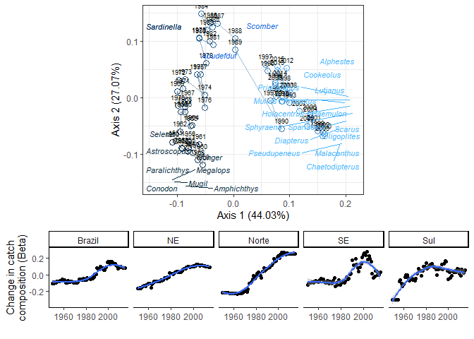

Diagnostics of Brazilian reef fisheries
================
Reef Synthesis Working Group (ReefSYN)
2023-01-17

<!-- README.md is generated from README.Rmd. Please edit that file -->
<!-- badges: start -->
<!-- badges: end -->

## TRENDS IN BRAZILIAN REEF FISHERIES OVER SPACE AND TIME

