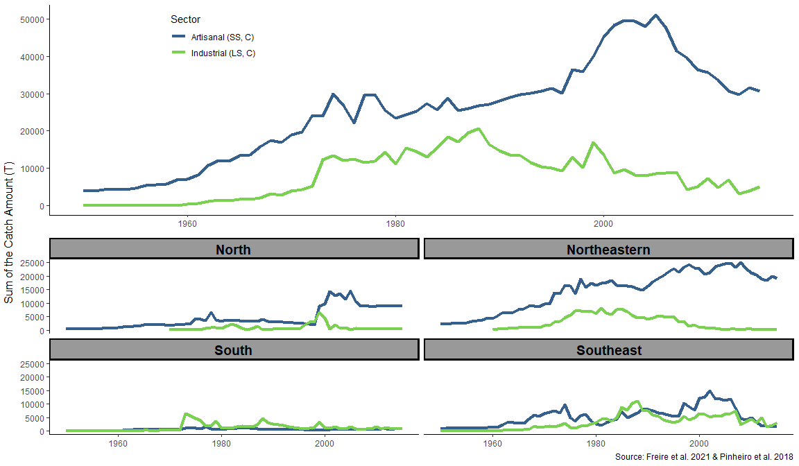
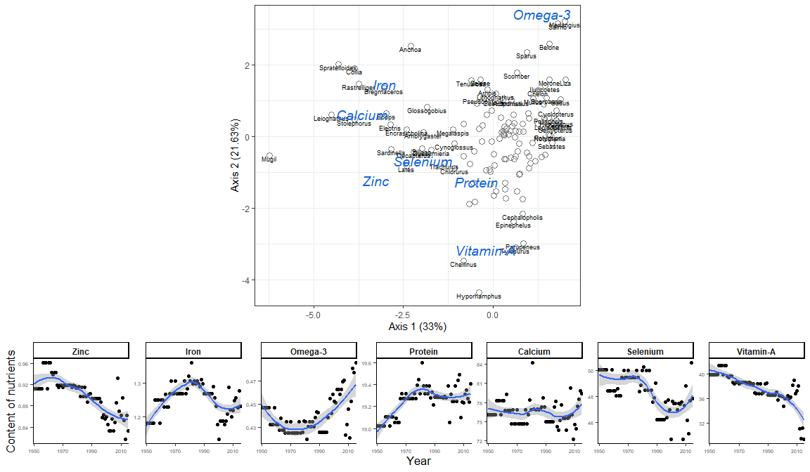

Diagnostics of reef fisheries in Brazil
================
Reef Synthesis Working Group
2022-06-23

<!-- README.md is generated from README.Rmd. Please edit that file -->
<!-- badges: start -->
<!-- badges: end -->

## TRENDS IN FISHERIES OVER TIME

<!-- --><!-- --><!-- -->
